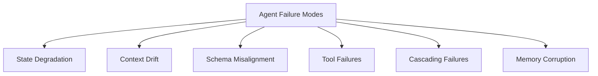

# Harness Engineering: The Missing Reliability Layer in Agentic AI Systems

## 1. Why Prompt Engineering Is No Longer Enough

The early era of Large Language Model (LLM) integration was dominated by prompt engineering. Developers quickly learned that natural language instructions could guide foundation models to perform specific text classification, generation, and transformation tasks. Techniques such as Few-Shot Prompting, Chain-of-Thought (CoT), and ReAct (Reasoning and Acting) expanded the boundaries of what a single LLM call could achieve.

However, as the industry transitions from simple query-response interfaces to **Agentic AI systems**—autonomous, long-running loops that plan, select tools, and self-correct—prompt engineering has hit a hard ceiling of diminishing returns. 

Prompting is fundamentally a *probabilistic guide* for a model's internal attention mechanism. It is not an engineering contract. You cannot prompt away network timeouts, tool schema drift, context window overflow, or type validation errors. Writing increasingly elaborate, multi-paragraph prompts to prevent an agent from invoking a tool incorrectly is an anti-pattern. It bloats the prompt token overhead, degrades latency, increases processing costs, and, crucially, still fails under statistical edge cases.

In production environments, we require deterministic systems. If an agent must write to a database, execute a transaction, or trigger an API call, it must do so within strict operational constraints. Relying entirely on the LLM’s ability to "follow instructions" in a prompt to ensure safety and correctness is a recipe for system instability. 

We must shift our focus from optimizing prompts to **engineering execution environments**. We need to surround the probabilistic reasoning of foundation models with deterministic software constraints. This is the origin of **Harness Engineering**.

---

## 2. The Reliability Problem in Agentic AI

When an AI model is given the authority to operate within an autonomous loop (planning actions, calling external APIs, and processing results recursively), the system's state space expands exponentially. In a standard pipeline, data flows linearly, and failures can be caught via standard input/output validation. In an agentic loop, the output of the model in step $N$ determines the input for step $N+1$.

This feedback loop introduces a major reliability challenge: **error compounding**.

If the agent makes a minor reasoning mistake or receives a slightly malformed payload from a tool at step 2, that error is written back into the agent's memory. By step 5, this minor discrepancy has compounded, leading to total state corruption, infinite loops, or catastrophic execution failures. 

Standard software engineering relies on assertions, type checking, and boundary validation to prevent state corruption. Agentic systems, by default, lack these layers. They run bare inside runtime loops, relying on the model to handle its own memory, state transitions, and recovery. 

To run agents safely in production, we must treat them as untrusted execution blocks. We must build a structured environment around them that intercepts, validates, and refines every input, output, memory update, and tool call.

---

## 3. Failure Modes of Long-Running Agents

To build an effective reliability framework, we must first catalog the specific failure modes of long-running, autonomous agents. These failure modes differ substantially from traditional software bugs.



### 3.1 State Degradation
As an agent executes a multi-step task, it accumulates state information (e.g., variable values, database records, execution flags). State degradation occurs when the agent writes malformed, stale, or contradictory data into its state dictionary. Because the LLM lacks strict type enforcement, it may write an integer where a string is expected, or omit required keys entirely, causing subsequent nodes in the execution graph to crash.

### 3.2 Context Drift
LLMs operate within a finite context window. In a long-horizon loop, the agent appends conversation history, tool outputs, and reasoning steps to its prompt. Without active context management, the prompt becomes bloated with noisy, irrelevant details. This context drift dilutes the model’s attention, causing it to lose track of the initial user goal, ignore system instructions, or hallucinate.

### 3.3 Schema Misalignment
Tools are the hands of the agent, exposing external databases, APIs, or calculators. Schema misalignment happens when a tool's API output structure changes slightly, or when the agent fails to format arguments to match the tool’s expected JSON schema. Even a minor mismatch (e.g., receiving `user_id` as an integer instead of a string) can halt execution or, worse, lead to corrupted database writes.

### 3.4 Tool Execution Failures
Unlike software interfaces that fail loudly with exceptions, tool failures inside agentic loops are often silent. A tool might timeout, return a 500 error, or return empty results. If the agent does not possess explicit logic to parse these error payloads, it will treat the error message as a valid result and attempt to reason over it, compounding the failure.

### 3.5 Cascading Agent Failures
In multi-agent systems, the output of one agent serves as the input or directive for another. A cascading failure occurs when a upstream agent fails silently or delivers low-quality output, and the downstream agent attempts to process this invalid input. Because downstream agents are typically optimized for specific tasks rather than broad error handling, they quickly degrade or halt.

### 3.6 Memory Corruption
Agents maintain short-term memory (in-context scratchpads) and long-term memory (external vector databases or key-value stores). Memory corruption occurs when irrelevant or false assumptions are persisted in long-term memory. During subsequent runs, the agent retrieves this corrupted context, leading to repetitive, incorrect, or biased planning decisions.

---

## 4. What Is Harness Engineering?

### 4.1 A Formal Definition
> **Harness Engineering** is the design, implementation, and operation of a deterministic runtime wrapper (a "harness") surrounding an agent's probabilistic core to enforce execution contracts, validate state transitions, isolate failures, and guarantee system-level reliability.

Unlike prompt optimization, which focuses on the model's inputs, or parsing, which focuses on formatting outputs, Harness Engineering is concerned with **runtime state and system boundaries**. It treats the agent as a black-box component that makes state mutation proposals. The harness reviews, filters, and commits those proposals only if they satisfy strict, pre-defined validation criteria.

```
+-----------------------------------------------------------+
|                      Runtime Harness                      |
|                                                           |
|    +-------------------+         +-------------------+    |
|    |    State Guard    |         |    Schema Guard   |    |
|    +---------+---------+         +---------+---------+    |
|              |                             |              |
|   Inputs --> |   [ Probabilistic Core ]   | --> Outputs  |
|              |         (LLM / Agent)       |              |
|              |                             |              |
|    +---------+---------+         +---------+---------+    |
|    |  Memory Validator |         |  Circuit Breaker  |    |
|    +-------------------+         +-------------------+    |
+-----------------------------------------------------------+
```

### 4.2 Differentiation from Adjacent Disciplines

*   **Prompt Engineering**: Focuses on natural language instruction design, formatting, and reasoning guides (e.g., Chain-of-Thought) inside the model prompt.
*   **Context Engineering**: Focuses on retrieving, filtering, and organizing the prompt payload (e.g., RAG context, system messages, dynamic user state) before it is passed to the LLM.
*   **Agent Orchestration**: Focuses on defining the workflow topology, message routing, and execution paths between nodes (e.g., CrewAI crews, LangGraph state charts).
*   **Harness Engineering**: Focuses on **runtime enforcement and reliability**. It acts as a safety envelope around the orchestration layer. While orchestration defines *where* the data goes, the harness enforces *what* that data is allowed to do, validating state at every step and recovering from failures.

---

## 5. Core Components of a Runtime Harness

A production-grade runtime harness must implement several modular components, each addressing a specific boundary of the agentic loop.

| Component | Responsibility | Failure Prevented |
| :--- | :--- | :--- |
| **State Validation** | Compares state mutations against a deterministic type schema before committing. | State degradation, invalid runtime types |
| **Schema Guards** | Intercepts tool calls and validates JSON payloads against target API schemas. | Malformed tool execution, upstream API crashes |
| **Runtime Contracts** | Asserts logical pre-conditions and post-conditions for every node execution. | Semantic reasoning drift, invalid outputs |
| **Context Integrity** | Actively prunes, summarizes, and structures prompt histories at runtime. | Context drift, attention dilution, token bloat |
| **Memory Verification** | Validates read/write requests to long-term memory before persistence. | Memory corruption, retrieval of obsolete context |
| **Failure Recovery** | Implements checkpoint rollbacks, retry backoffs, and alternative tool routing. | Infinite execution loops, hard halts |
| **Circuit Breakers** | Monitored counters that trip and halt execution if iteration or cost limits are hit. | runaway token bills, infinite self-correction loops |
| **Human Approval Gates** | Pauses execution and persists agent state, waiting for human confirmation. | Unauthorized actions, high-risk database writes |
| **Observability Hooks** | Telemetry emitters logging execution latency, step counts, and token usage. | Black-box behavior, unmonitored production runs |

---

## 6. Reference Architecture

To keep this pattern framework-agnostic, we present the reference architecture for an **Agent Runtime Harness**. The harness acts as a deterministic boundary wrapper that decouples the stochastic LLM from direct execution targets.


```
                                  User Request
                                       |
                                       v
+-----------------------------------------------------------------------------+
|                               RUNTIME HARNESS                               |
|                                                                             |
|  +-----------------------------------------------------------------------+  |
|  | 1. INPUT GUARDRAIL (Prompt Shield, Policy & Guard Enforcer)           |  |
|  +-----------------------------------+-----------------------------------+  |
|                                      |                                      |
|                                      v                                      |
|  +-----------------------------------------------------------------------+  |
|  | 2. CONTEXT & MEMORY MANAGER (Pruning, Retrieval, Summarization)       |  |
|  +-----------------------------------+-----------------------------------+  |
|                                      |                                      |
|                                      v                                      |
|  +-----------------------------------------------------------------------+  |
|  | 3. LLM REASONING CORE (Model Planning & Stochastic Proposal)           |  |
|  +-----------------------------------+-----------------------------------+  |
|                                      |                                      |
|                                      +--------------------------+           |
|                                      | (Proposed Tool Call)     |           |
|                                      v                          v           |
|  +-----------------------------------+-------------------+  +---+----+---+  |
|  | 4. INLINE GUARDRAIL (Schema Guard & Policy Checker)    |  | 5. HITL    |  |
|  +-----------------------------------+-------------------+  |    GATE    |  |
|                                      |                      | (Approval) |  |
|                                      v                      +---+----+---+  |
|  +-----------------------------------+-------------------+      |           |
|  | 6. EXECUTION SANDBOX (Deterministic Isolation / MCP)   | <----+           |
|  +-----------------------------------+-------------------+                  |
|                                      |                                      |
+--------------------------------------|--------------------------------------+
                                       v
                     +-----------------+-----------------+
                     | 7. AUDIT & TRACE LEDGER           |
                     |    (Observability Sink)           |
                     +-----------------------------------+
```

### Execution Flow & Subsystems:

1.  **Input Guardrail**: The initial security gate. It intercepts user queries and incoming context to block prompt injections, jailbreaks, and policy violations before calling the model.
2.  **Context & Memory Manager**: Intercepts reads and writes to short-term/long-term memory. It manages prompt size by summarizing history, pruning stale tool outputs, and dynamically injecting relevant knowledge via hybrid vector lookup.
3.  **LLM Reasoning Core (Model)**: The central processing node where the LLM reasons over the context and proposes the next step (either final text output or a tool execution request).
4.  **Inline Guardrail**: Intercepts the LLM's proposed tool invocation. It performs dry-run schema validations and evaluates structural correctness. If validation fails, it generates detailed failure feedback and returns it to the reasoning node (self-repair).
5.  **Human-in-the-Loop (HITL) Gate**: A serialized interrupt gate. For high-risk, privileged, or irreversible tool invocations (e.g., monetary transactions, database deletes), execution halts, state checkpointers are saved, and the harness awaits explicit human sign-off.
6.  **Execution Sandbox**: The deterministic workspace (e.g., containerized sandboxes, isolated runtime plugin slots using MCP) where verified tool calls are executed, protecting host systems from untrusted agent output.
7.  **Audit & Trace Ledger**: Emitters logging structured executions, latencies, cost, tokens, and decisions for audit compliance and observability.

### Execution Flow:
1.  **State Guard Inspection**: Incoming request and current system state are validated. If pre-conditions are unmet, execution aborts before invoking the LLM.
2.  **Context Hygiene**: Prompt assembly is managed dynamically to strip obsolete tool metadata and summarize chat history.
3.  **LLM Execution**: The LLM suggests the next transition (either output or a tool call).
4.  **Schema Guard Interception**: The proposed transition is intercepted. If it is a tool call, arguments are verified against the target schema.
    *   *If valid*: The call proceeds.
    *   *If invalid*: The harness halts the execution, generates a deterministic error description, and feeds it back to the LLM for correction (self-repair).
5.  **State Checkpoint**: A state checkpoint is committed to a persistent store. If subsequent steps fail, the system rolls back to this checkpoint.

---

## 7. Implementation Patterns

Let's explore how these framework-agnostic harness components map onto popular AI orchestrators.

### 7.1 LangGraph
LangGraph organizes agentic workflows using state charts (graphs with nodes and edges). State is held in a centralized state model (e.g., a Pydantic class).

*   **Harness Implementation**:
    *   **State Guard**: Enforced by using strict Pydantic models for the graph state.
    *   **Checkpointing**: Implemented natively via `SqliteSaver` or custom Postgres checkpointers. This enables thread persistence, rollbacks, and human-in-the-loop pause points.
    *   **Interceptor Node**: Introducing a custom "Validator" node immediately preceding tool invocation. This node runs standard schema validation and can reroute the edge to an error-handling node instead of the tool execution node if validation fails.

### 7.2 OpenAI Agents SDK
The OpenAI Agents SDK focuses on building agents using assistant runs, function calling, and structured outputs.

*   **Harness Implementation**:
    *   **Schema Guard**: Enforced by utilizing `response_format` containing JSON schema definitions (e.g., Pydantic schema wrappers) to force the model to output strict JSON payloads.
    *   **Tool Validation Interceptor**: Wrapping the agent's function-calling loop. When the assistant proposes a function call, the wrapping harness intercepts it, verifies arguments, and returns custom string errors directly to the execution run without executing the function if validation fails.

### 7.3 CrewAI
CrewAI focuses on multi-agent collaboration with structured tasks and shared memories.

*   **Harness Implementation**:
    *   **Runtime Contracts**: Handled by adding validation decorators to custom CrewAI tools. 
    *   **Circuit Breaker**: Implemented by configuring the `max_iter` and `max_rpm` variables on individual Agents, preventing infinite agent loops.
    *   **Custom Task Callback**: Overriding `task_callback` and `action_callback` to inspect state mutations and output JSON schemas before the next agent takes over.

### 7.4 Semantic Kernel
Semantic Kernel provides a modular kernel environment using plugin structures.

*   **Harness Implementation**:
    *   **Filters**: Implementing custom `IFunctionInvocationFilter` and `IPromptRenderFilter`. This executes deterministic code before a plugin function is called or before a prompt is rendered, serving as a clean implementation of the harness interceptor middleware pattern.

---

## 8. Production Considerations

Operating a harness in a production environment introduces several scaling, cost, and design trade-offs.

### 8.1 Monitoring and Telemetry
A runtime harness must emit clean telemetry. We recommend tracking:
*   **Correction Cycles**: The number of times the Schema Guard caught an error and returned it to the LLM for correction. A high ratio indicates prompt fragility or schema misalignment.
*   **Circuit Breaker Trips**: Runaway token usage or iteration threshold breaches.
*   **State Drift Score**: A measurement comparing the schema complexity of the state dictionary at start vs. end.

### 8.2 Failure Recovery Policies
When an error occurs, the harness can choose from several recovery strategies:
1.  **Self-Correction**: Return the stack trace or validation error to the LLM, prompting it to correct its mistake.
2.  **Graceful Degradation**: Route the request to a default, safe fallback node (e.g., returning a canned response or skipping an optional processing step).
3.  **Human Escalation**: Halt execution, save the thread ID, and notify an engineer or customer agent to resolve the block.

### 8.3 Testing the Harness
Because a harness is deterministic, it can be tested using standard unit and integration testing frameworks (e.g., PyTest). You should write tests that:
*   Inject malformed tool arguments and verify the Schema Guard correctly blocks execution.
*   Assert the Circuit Breaker trips after the maximum step count is reached.
*   Verify state rollbacks work correctly on database transaction failures.

---

## 9. The Future of Harness Engineering

As foundation models become more capable, their raw reasoning capacity will increase. However, the requirement for system-level reliability will never go away. 

Just as **Context Engineering** emerged to solve the challenge of input precision (moving past simple prompt tricks to structured, dynamic data injection), **Harness Engineering** is emerging to solve the challenge of execution precision. 

By building formal, framework-agnostic runtime harnesses, we free ourselves from the fragile loop of prompt tuning. We can let models do what they do best—reason, analyze, and plan—while software engineering principles do what they do best: provide rigid, safe, and predictable guardrails. In the future of enterprise AI, the runtime harness will be considered as fundamental as the database connection or the REST router.
